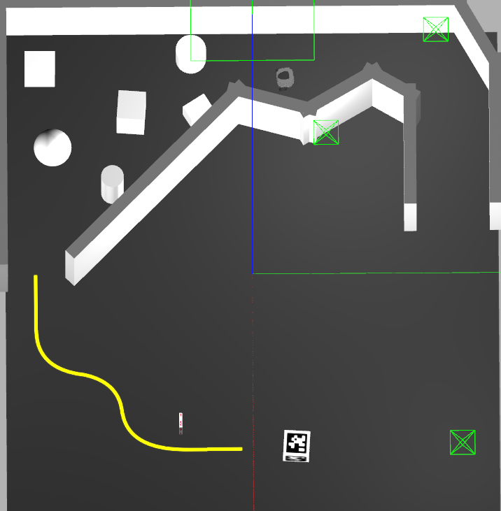
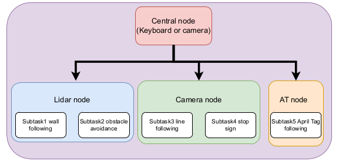
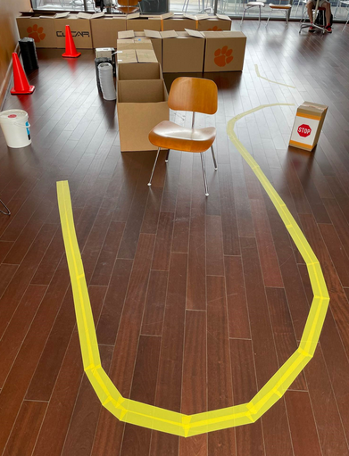

# AuE8230Spring23_final_project
This is the ROS project folder for the AuE8230 course final project. 

The video link is in the "videos" folder which is a public google drive folder you can check.

## Table of contents
The project contains majorly 2 tasks, 
- Final project simulation
- Final project real world project

### Task 1: Final project simulation
Students are required to control the turtlebot3 to complete five subtasks in the gazebo simulation environment, including wall following, obstacle avoidance, line following, stop sign detection and April Tag following.



Run the following command in the terminal to start the simulation.

```bash
roslaunch aue_finals final_simulation.launch
```

In order to control the AprilTag box, run the following command and control the AprilTag using the keyboard.

```bash
rosrun teleop_twist_keyboard teleop_twist_keyboard.py /cmd_vel:=/robot2/cmd_vel
```

To efficiently design the control algorithm and tune the parameters, we design a centralized object-oriented structure to control the turtlebot to complete each subtask and transition between each subtask. Centralized object-oriented structure is more readable and adjustable than the process-oriented structure.



https://drive.google.com/file/d/1XqQkmkaIvp1d43rBZ4SN2Cfl3Hw1fSkw/view?usp=share_link

### Task2: Real world task
Students are required to control the real turtlebot to complete the similar five tasks in the real world environment, including wall following, obstacle avoidance, line following, stop sign detection and April Tag following.




Before controlling the turtlebot, we need to start the turtlebot, connect it and open the camera.

PC:
```bash
roscore
```

PBC:
```bash
roslaunch turtlebot3_autorace_camera raspberry_pi_camera_publish.launch
roslaunch turtlebot3_bringup turtlebot3_robot.launch
```

Run the following command in the terminal to control the real turtlebot.

```bash
roslaunch aue_finals final_real.launch
```
https://drive.google.com/drive/u/1/folders/1kz5sJ-2PXmqZvi-nKp118q2TwNGri_7M
